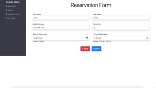

# Period Tables - A Restaurant Reservation Application

### Summary

---

This is a full stack web application that allows restaurant employees and managers to create, edit, and cancel reservations. Alongside that, they can create tables, clear and assign reservations to those tables, as well as search the database for a particular reservation.

The development process included the following:

- Project management and tracking with Github Projects
- The use of a separate branch, "development", that periodically merged into "main".
- Monorepo deployment with Heroku

