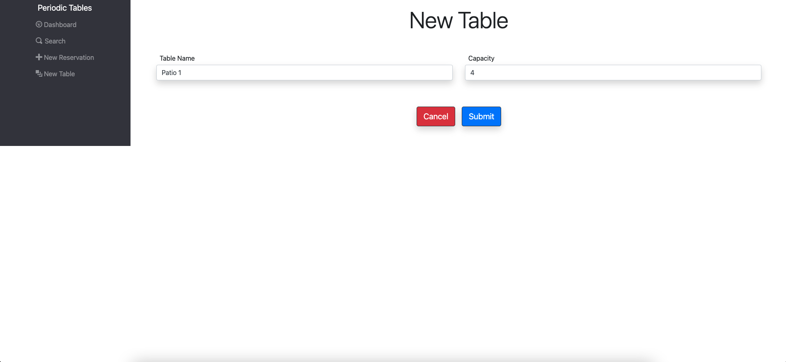

# Period Tables - A Restaurant Reservation Application

## Link to App

[Periodic-Tables](https://periodic-tables-client-three.vercel.app/)

---

## Summary

This is a full stack web application that allows restaurant employees and managers to create, edit, and cancel reservations. Alongside that, they can create tables, clear and assign reservations to those tables, as well as search the database for a particular reservation.

The development process included the following:

- Project management and tracking with Github Projects
- The use of a separate branch, "development", that periodically merged into "main"
- Backend deployment with Heroku, frontend deployment with Vercel
- A lot of coffee

---

## Screenshots

### Dashboard


### Create a Reservation


### Create a Table



### Search for Reservation


### Seat a Reservation


---

## JSON Examples

> These are examples of server responses for tables and reservations

### reservation

```
{
  data: {
    "reservation_id": 11,
    "first_name": "Christopher",
    "last_name": "Roddy",
    "mobile_number": "123-321-0987",
    "reservation_date": "2021-09-13T04:00:00.000Z",
    "reservation_time": "13:30:00",
    "people": 4,
    "status": "booked",
    "created_at": "2021-09-13T09:34:07.185Z",
    "updated_at": "2021-09-13T09:34:07.185Z"
  }
}
```

### table

```
{
  data: {
    "table_id": 2,
    "table_name": "Table 2",
    "capacity": 4,
    "reservation_id": 11
  }
}
```

> At the moment, I have only used simple bootstrap styling. I plan to come back in the near future to customize this website quit a bit more!
